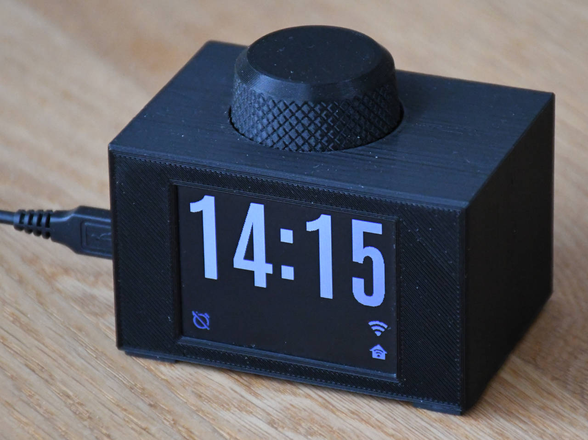

# Crescendo Clock - an ESP32 based alarm clock to wake up gently
A self-made clock with a gentle crescendo functionality.

  
  

## Highlights
- Gentle alarm-clock with a crescendo function to wake up slowly and peacefully
- Simplified user interaction with a rotary encoder with a button. No touch display, no need for 10 different buttons
- Convenient WiFi connection via WPS. Credentials are then stored in NVS flash of the board
- Custom 3D printed case
- Integration with home assistant via MQTT messages (i.e. to create a wake up light effect)
- Light sensor to turn off display at adjust the brightness dynamically
- Written in C++ with ESP-IDF framework (no Arduino!) using Platformio + VSCode

## Electrical components
These are the main electrical components used in this project:
- [ESP-C3-32S-Kit ESP32 WiFi+Bluetooth Development Board](https://www.waveshare.com/esp-c3-32s-kit.htm) with ESP32C3 chip from Ai-Thinker which I have "tuned" to get rid of the built-in LEDs. 
- [Rotary encoder with board](https://www.ebay.de/itm/173657244984)
- [2.4 inch display with ILI9341 driver](https://www.waveshare.com/2.4inch-lcd-module.htm)
- [DFRobot's DFPlayer Mini](https://www.dfrobot.com/product-1121.html) (assuming I am using the same HW, see [the hardware folder](hardware/README.md) to see more details on this topic)
- [Light sensor](https://www.adafruit.com/product/2748)
- [Mini-speaker](https://www.ebay.de/itm/313914312809)
- Miscellaneous components, like resistors, capacitors, wires...

See the [detailed description](hardware/README.md) in the hardware folder for more information about schematics, PCB, 3D printed case, alternative components and other design considerations.

## Software
Assuming basic knowledge about platformio, ESP-IDF development and ESP32 boards: in order to compile this project you will need:
- Your populated PCB board with the ESP32C3 board connected to the PC via USB
- Visual Studio Code with platformio extension installed and Espressif platform 6.1 installed. Platform updates may cause the code to break, this happened during development several times. If you want to avoid this, set the line `platform = espressif32@=6.1.0` in the file [platformio.ini](platformio.ini)

Just build and upload the code! If you upload to code to the board with no hardware connected to it (display, encoder, etc.) you should at least be able to see some basic debug messages via Serial Monitor related to the failed WiFi connection.

## Waking melodies and other settings
In this repository there is not any audio file for the waking melody. In the [DFPlyer mini wiki](https://wiki.dfrobot.com/DFPlayer_Mini_SKU_DFR0299) you will find instructions on how to create your own files (see chapter ["Copy your mp3 into you micro SD card"](https://wiki.dfrobot.com/DFPlayer_Mini_SKU_DFR0299#target_6)). I have a folder called `mp3` in the SD-card and inside it a single file called `0001.mp3`. You can add further files and change the value of `melody_nr` in the `settings` struct in [src/clock_machine.hpp](src/clock_machine.hpp) and add the corresponding mp3 file. In case you want a confirmation sound when you activate the alarm, then set the settings variable `alarm_set_confirmation_sound` to true and make sure a (short) `0101.mp3` file exists. This does not work really well, as the DFPlayer doesn't seem to like short audio files, and I will most likely remove this feature in a near future.

Furthermore, you can change also the snooze time (default = 5 minutes) and the "crescendo speed" in the same `settings` structure. These are fixed values and cannot be changed after compilation.

## Credits and acknowledgment
For this project I have used the inspiration and code from many other projects and sources: 
- I looked up and partly copied some code from the official esp-idf examples contained in https://github.com/espressif/esp-idf/tree/master/examples (mainly those related to SNTP, WPS, MQTT and Wifi functions)
- For the rotary encoder I used some code from https://github.com/LennartHennigs/ESPRotary as well as from https://github.com/craftmetrics/esp32-button. The code from https://github.com/DavidAntliff/esp32-rotary-encoder was also a good source of inspiration
- For the finite state machine implementation I borrowed the ideas from https://www.aleksandrhovhannisyan.com/blog/finite-state-machine-fsm-tutorial-implementing-an-fsm-in-c/ as well as from https://stackoverflow.com/questions/14676709/c-code-for-state-machine
- For the DFPlayer module used this datasheet to look up the specifications https://cdn.shopify.com/s/files/1/1509/1638/files/MP3_Player_Modul_Datenblatt.pdf?10537896017176417241. I also found some undocumented functions in the library implementation in https://github.com/DFRobot/DFRobotDFPlayerMini
- [Adafruit](https://www.adafruit.com/) for the many resources I used for the creation of custom fonts and symbols (see a [more detailed description](fonts/README.md) in the resources folder) as well as for the great inspiration from their [PyPortal Alarm Clock](https://learn.adafruit.com/pyportal-alarm-clock), out of which I created a very first concept of this kind of crescendo clock. 

## License
Copyright (c) 2023 javiser
`crescendo-clock` is distributed under the terms of the MIT License.

See the [LICENSE](LICENSE) for license details.

