# Hardware
## Schematics and PCB design

    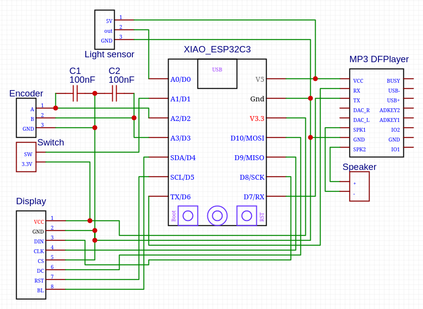
    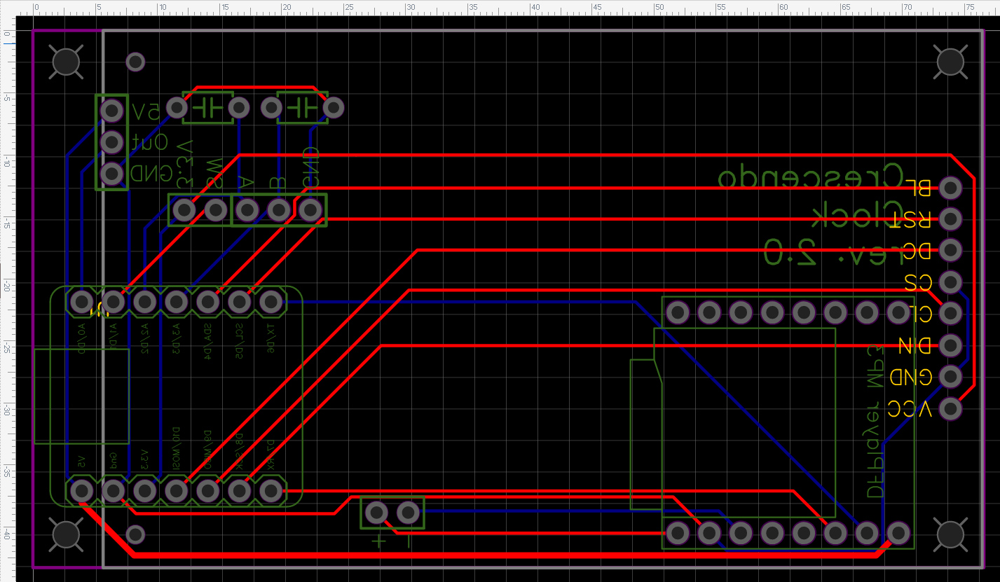

A couple of mentions to design considerations:
- The capacitors were used in a previous design to add some debouncing. In the current [rotary encoder](https://www.ebay.de/itm/173657244984) used, the board most likely has that already. But it doesn't harm to have them, at least in practice
- With the exception of some SPI pins for the [display](https://www.waveshare.com/2.4inch-lcd-module.htm) and the fact that the light sensor needs an analog input, which pins to use on the ESP32 board should is actually a very free decision
- The design was made using EasyEDA and the [created GERBER files](Gerber_PCB_Crescendo_Clock_Board_rev1.1.zip) and the board manufactured by [JLCPCB](https://jlcpcb.com). This is the result:

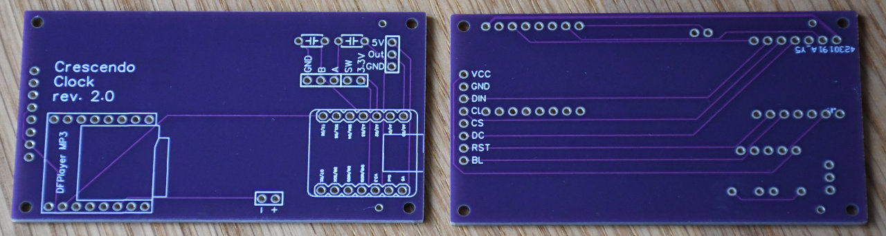

## Board assembly

### Display connector removal
The big connector on the rear side of the display is not needed and needs to be removed in order to build the board properly. Just cut the the pins with some pliers and then you can slide out the connector:

    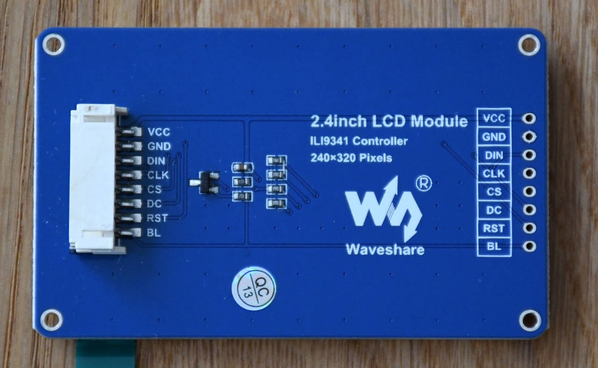
    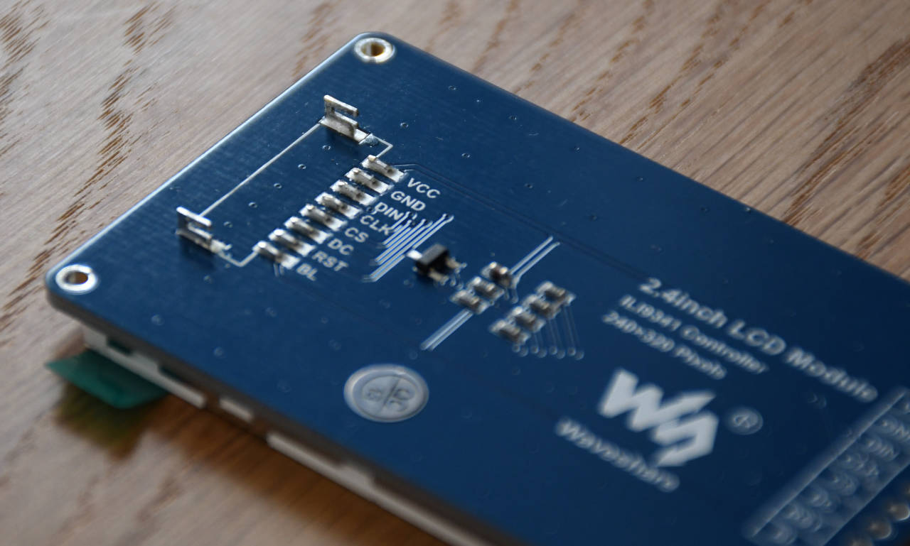

### ESP32 board RGB LEDs removal
The [ESP-C3-32S-Kit board](https://www.waveshare.com/esp-c3-32s-kit.htm) has some embedded LEDs which need to be removed in advance. This is just done using brute force and some small pliers. This is the result:
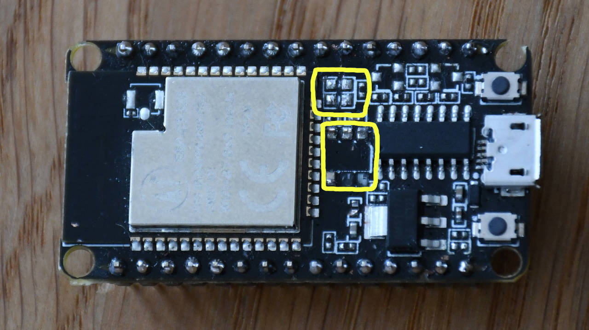

### DFplayer modification
The [DFPlayer I am using](https://www.berrybase.de/dfrobot-dfplayer-mini-mp3-player) has some noise problems after the alarm sound is stopped. This seems to be a well known problems and after some research I came into this solution https://work-now-dammit.blogspot.com/2016/08/dfplayer-mp3-module-power-onoff-clicks.html. The main idea is to break the connection of the pin1 of the 8002 amplifier chip with GND and wire that to the BUSY pin (16) of the module, something like this (my apologies for the dirty work):

    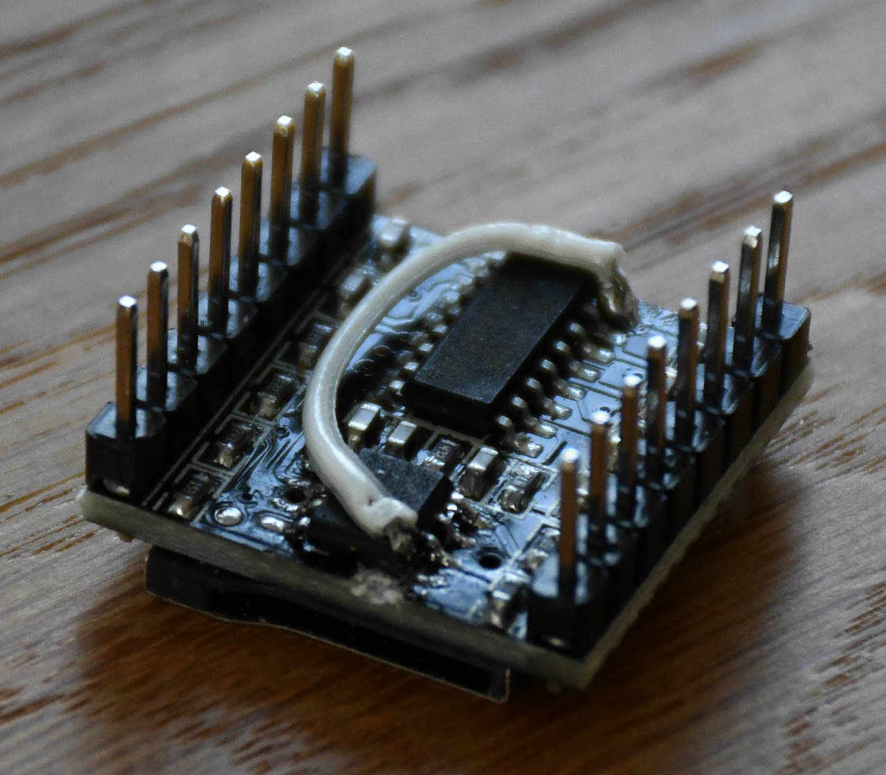
    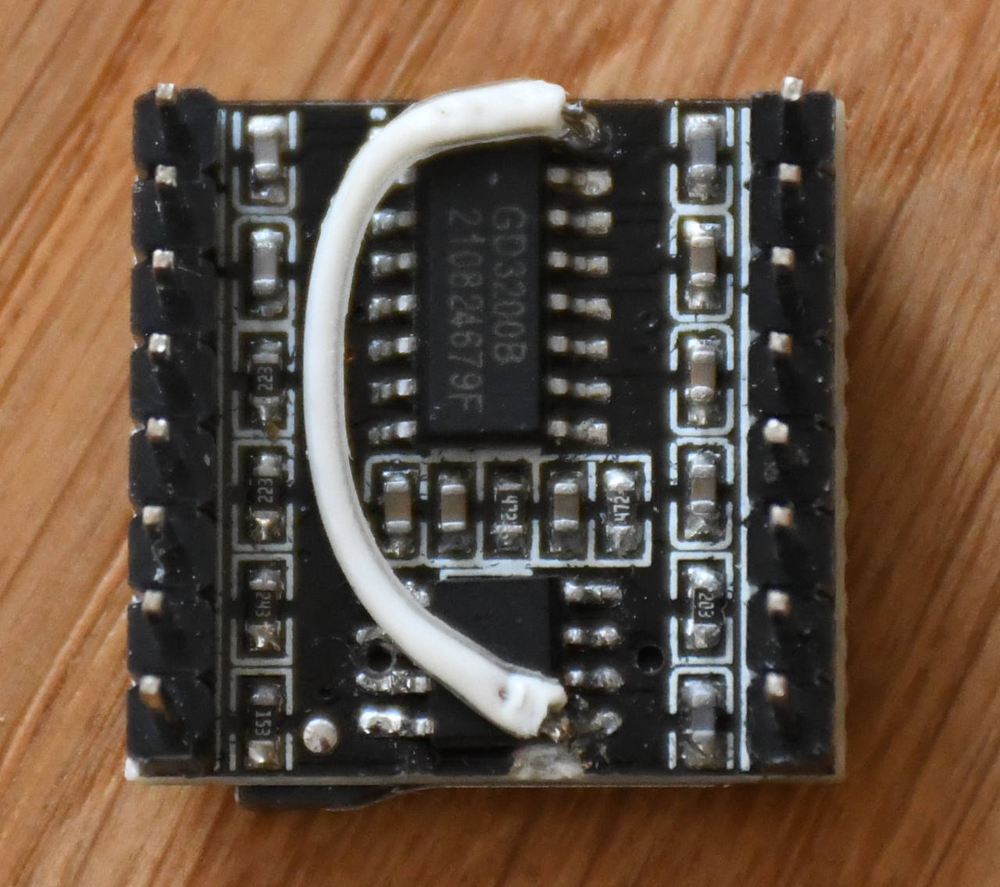

You can lift the pin 1 leg of 8002 amplifier with a very pointy soldering iron and then solder a small cable from that leg to the pin 16 of the module.

### Soldering all together
1. Solder the 1x20 pin male header on the display and 2 additional 1x1 ones as support. You can use the still empty PCB board as a holder:

    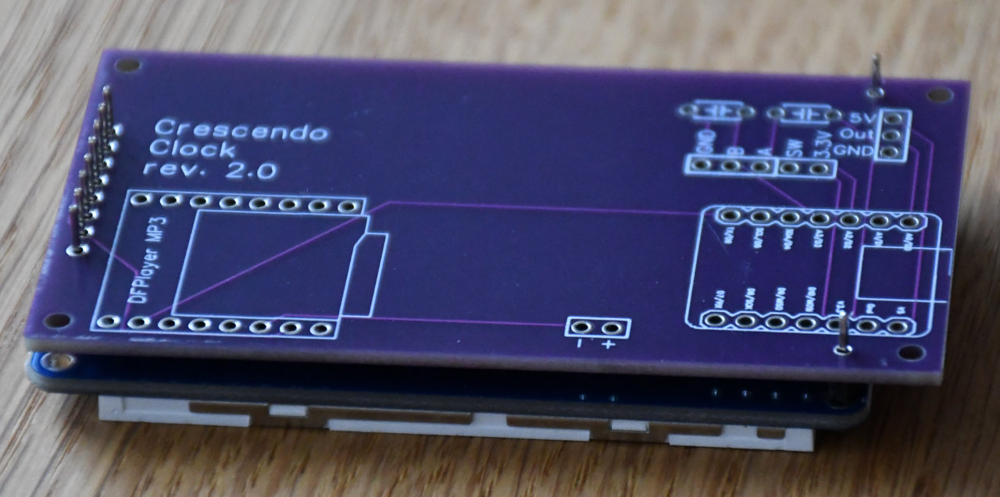
    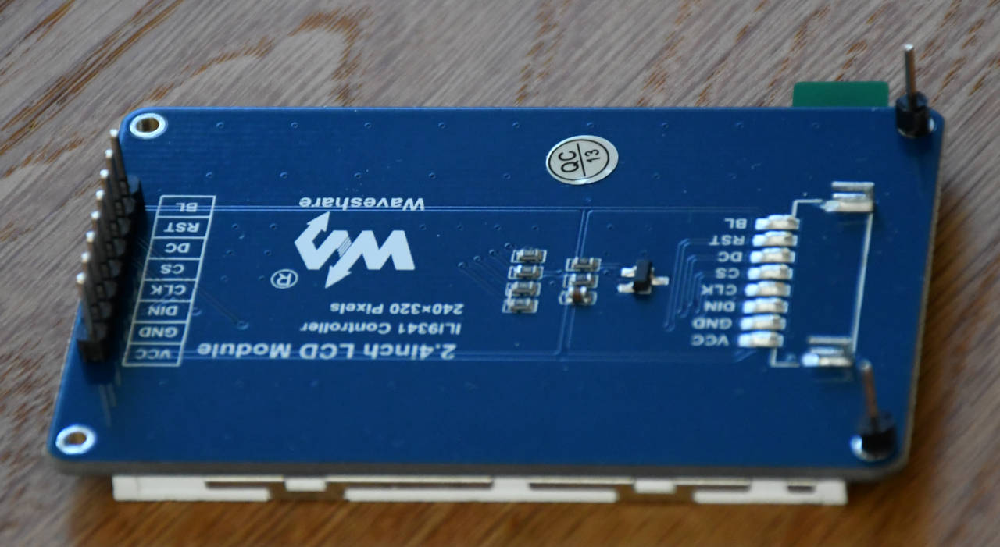

2. Solder a 1x3 90° pin male header on the [light sensor breakout board](https://www.adafruit.com/product/2748). Pay attention to the orientation!

    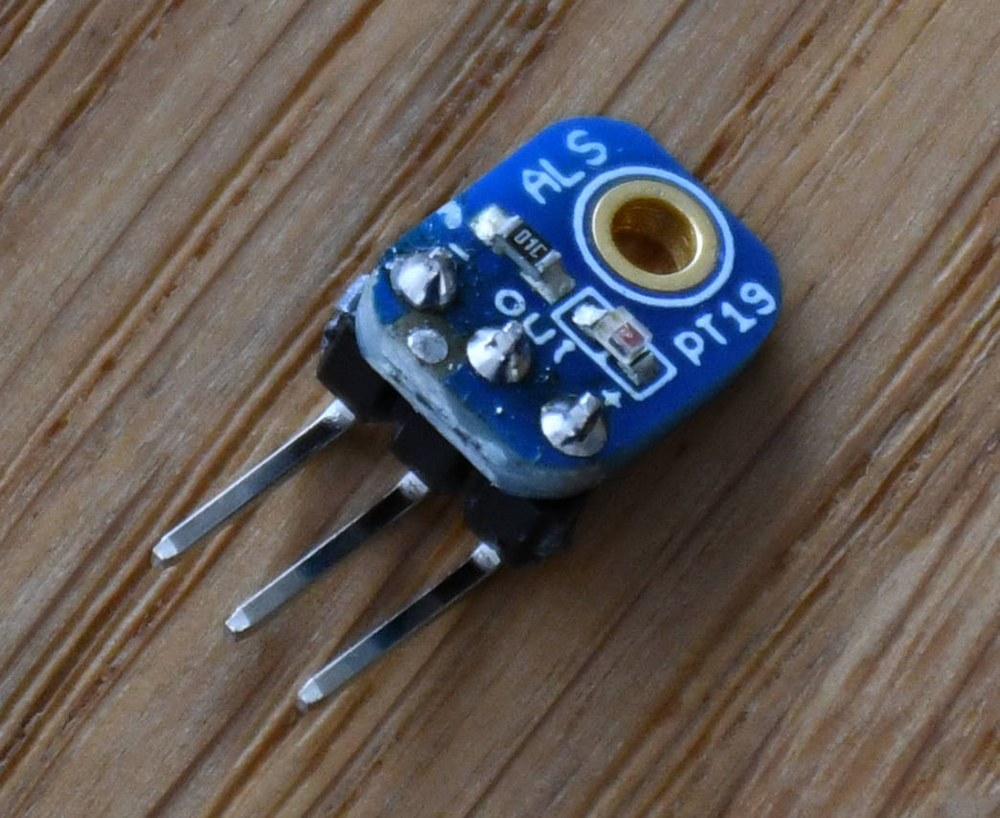

3. Solder all components to the PCB board and trim the excess length of the pins to make room for the display board

    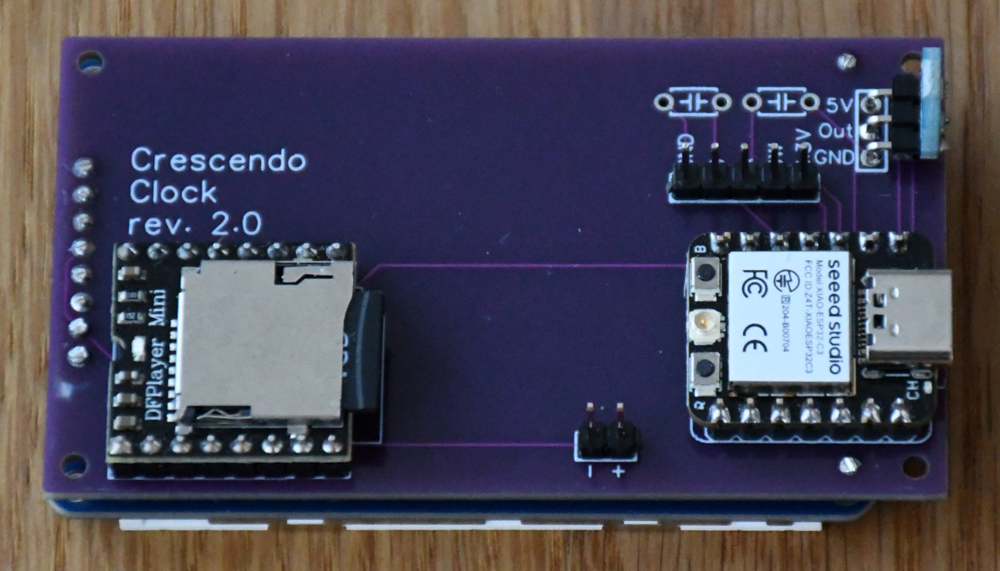
    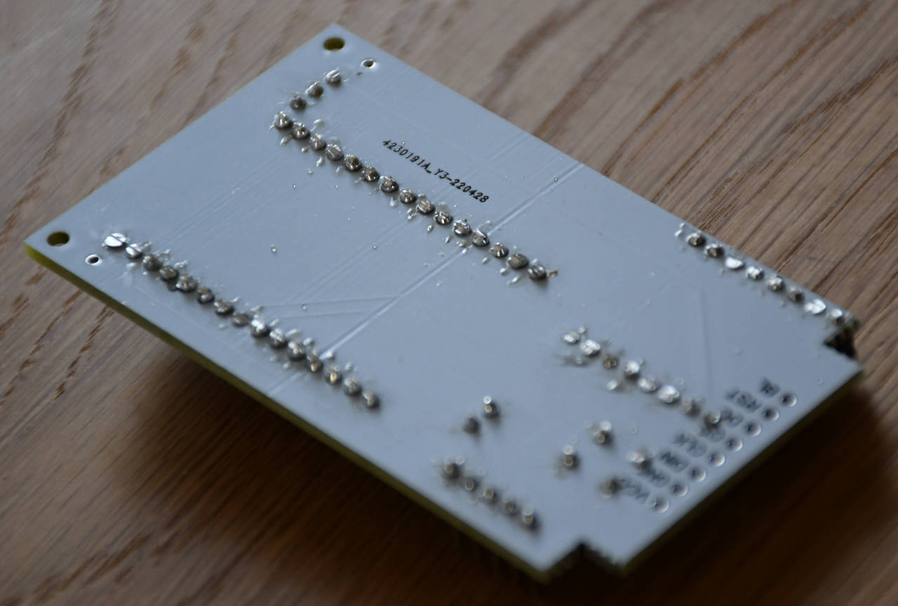

4. Solder the display on the other side of the board. After that it would be a good time to do a sanity check and connect the board to the PC and upload the SW:

    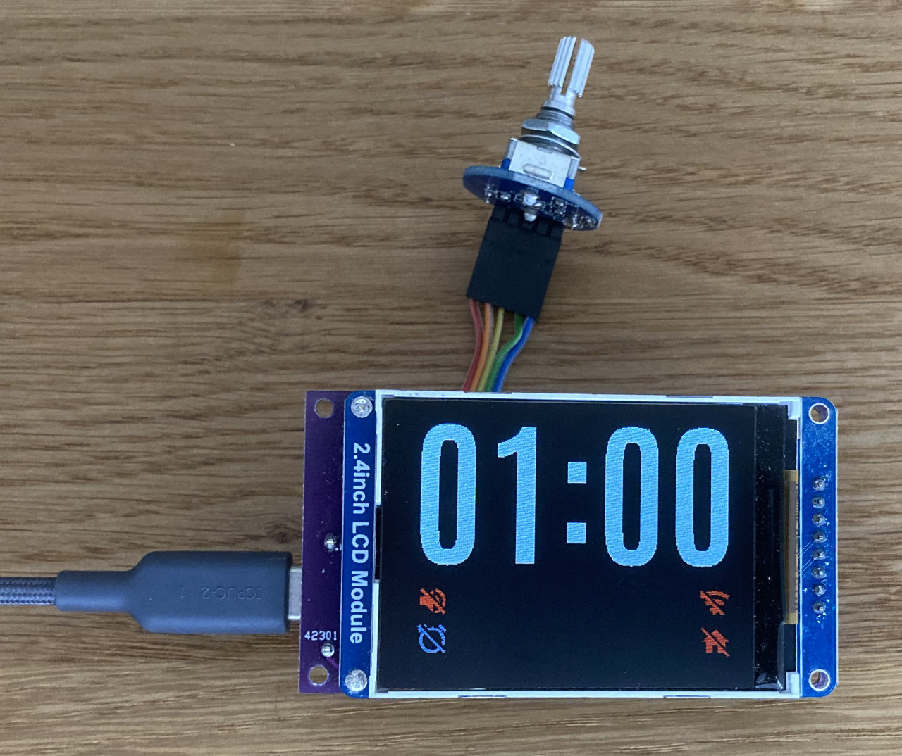

## 3D printed case
STL files for the case, the rear cover and the knurled rotary botton are available:

I printed these with PLA using an Ender 3 v2. Pay attention to the orientation when slicing: the clock front side, the outside face of the rear cover as well as the top face of the button should be your first layer. You may use supports for the big case, I didn't use any and it went ok. 

## Final assembly
1. You will need 
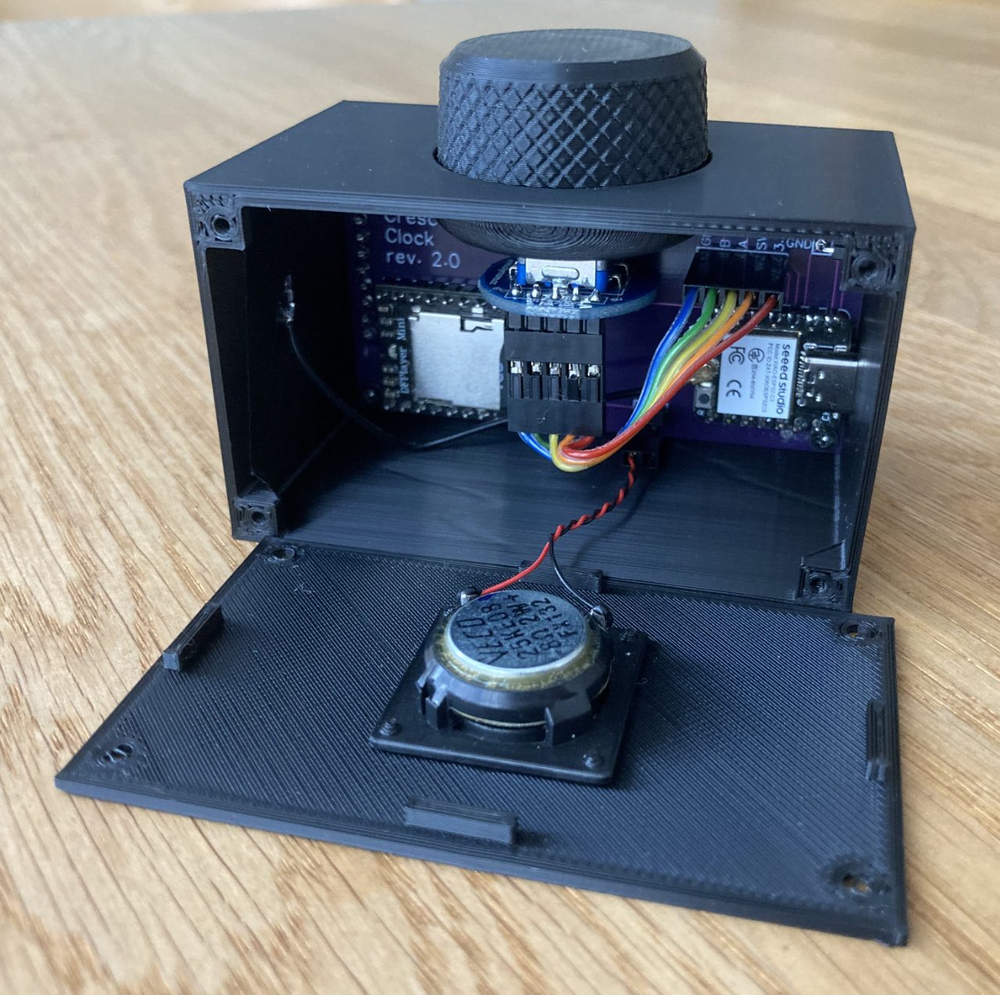

## Possible modifications and variants
The components used are just what I could get my hands on or what made sense to me. Here some considerations:
- It should be possible to use any other ESP32 board, specially ESP32C3 like the official [ESP32-C3-DevKitM-1](https://docs.espressif.com/projects/esp-idf/en/latest/esp32c3/hw-reference/esp32c3/user-guide-devkitm-1.html) from Espressif. But the board design and/or pin assignments defined in [clock_common.hpp](src/clock_common.hpp) may need a corresponding adjustment. Unfortunately, the ESP32 board I used has been discontinued by Waveshare, so that future builds of this clock will need these adaptions. I am already working on a new version based on the [Seeed Studio XIAO ESP32C3](https://wiki.seeedstudio.com/XIAO_ESP32C3_Getting_Started/)
- Other LCD displays could work as well, specially if the same ILI9341 driver is used, but maybe other settings are required. Since the used library LovyanGFX supports a lot of different displays, changing to another display is just a matter of adjusting the configuration and, if the resolution changes, the layout (font sizes, symbol and text positions)
