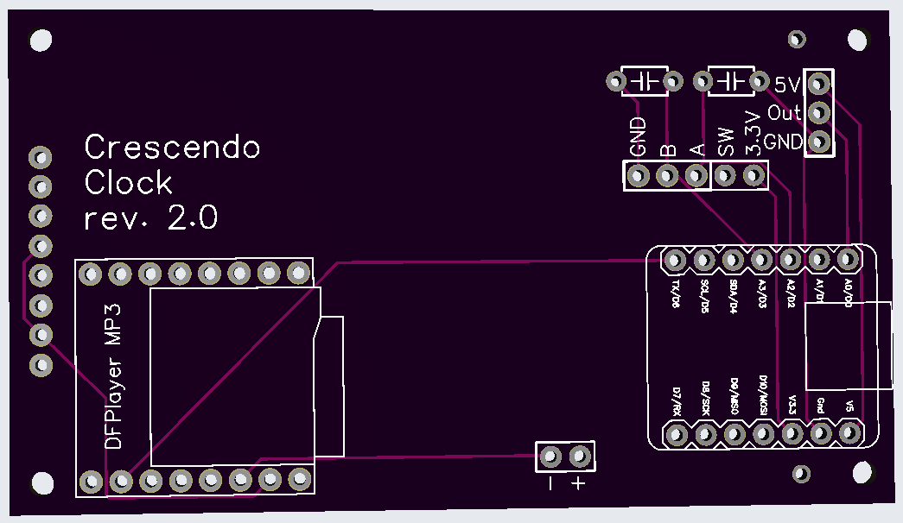
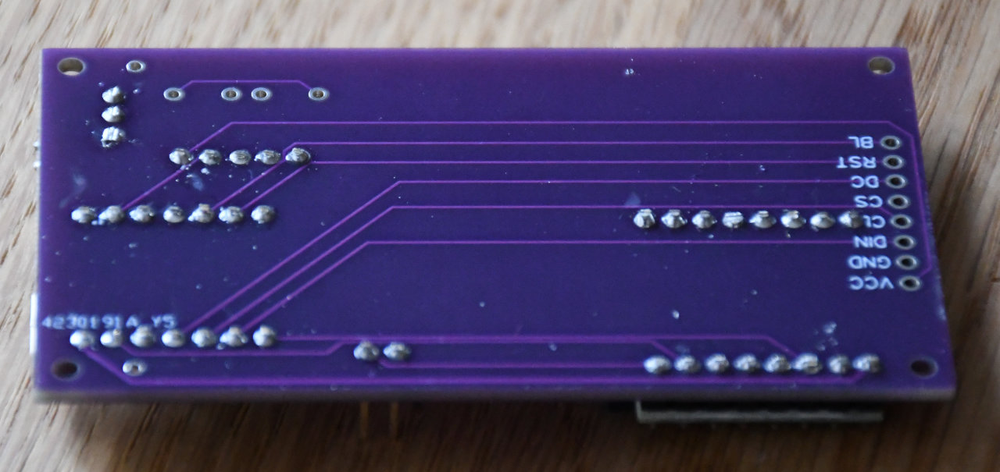
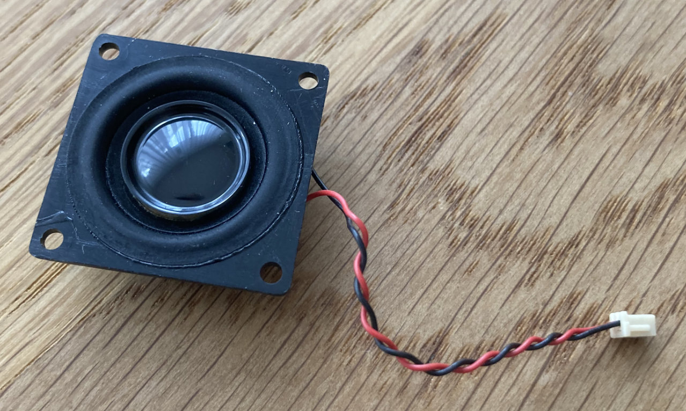
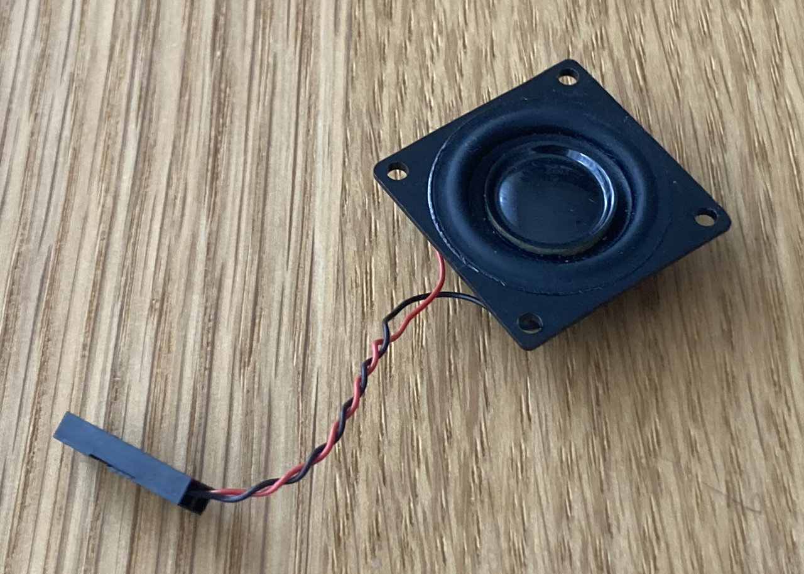
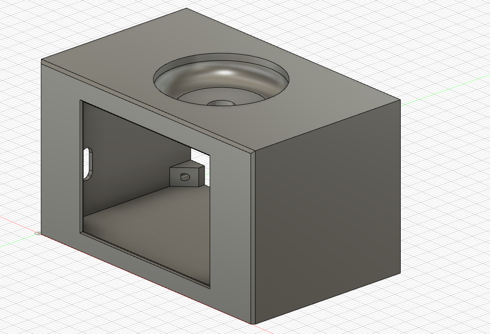

# Hardware
## Schematics and PCB design

    
    
    

A couple of mentions to design considerations:

- The capacitors were used in a previous design to add some debouncing. In the current [rotary encoder](https://www.ebay.de/itm/173657244984) used, these capacitors are already include and are not soldered anymore
- With the exception of some SPI pins for the [display](https://www.waveshare.com/2.4inch-lcd-module.htm) and the fact that the light sensor needs an analog input, which pins to use on the ESP32 board should is actually a very free decision
- The design was made using EasyEDA and the [created GERBER files](Gerber_PCB_Crescendo_Clock_Board_rev2.0.zip) and the board manufactured by [JLCPCB](https://jlcpcb.com). This is the result:

## Board assembly

### Display connector removal
The big connector on the rear side of the display is not needed and needs to be removed in order to build the board properly. Just cut the the pins with some pliers and then you can slide out the connector:

    
    

### Soldering all together
1. Solder the 1x8 pin male header on the display and 2 additional 1x1 ones as support. You can use the still empty PCB board as a holder:

    
    

2. Solder a 1x3 90° pin male header on the [light sensor breakout board](https://www.adafruit.com/product/2748). Pay attention to the orientation!

    

3. Solder all components to the PCB board and trim the excess length of the pins to make room for the display board

    
    

4. Solder the display on the other side of the board. 

    
    

5. Prepare a connection cable with 5 pins for the connection between the board and the rotary encoder breakout. Again, I used dupont connectors for this:

6. If necessary, change the connector of the mini-speaker. I used dupont connectors for this:
   

    
    
    

7. After that it would be a good time to do a sanity check and connect everything together, flash the SW into the board and check whether everything is working as expected:

## 3D printed case
STL files for the [case](3D/case.stl), the [rear cover](3D/rear_cover.stl) and the [knurled rotary botton](3D/knurled_button.stl) are available:

    
    

I printed these with PLA using an Ender 3 v2. Pay attention to the orientation when slicing: the clock front side, the outside face of the rear cover as well as the top face of the button should be your first layer. You may use supports for the big case, I didn't use any and it went ok

## Final assembly
In order to assemble everything you will need at least:
- Soldering iron, tin, etc
- Cables and connectors (i.e. with dupont crimps)
- 4 screws M2x4 and 4 screws M2.5x8 

Follow these steps:
1. Put an SD card with the necessary audio files
2. Slide in the finished board and screw it into the case using the M2.5x8 screws
3. Connect the cables to the rotary encoder and slide it into its place. Put the washer and hex nut and tighten it. Make sure it is perpendicular. Insert the button into the shaft
4. Attach the speaker on the rear cover. Pay attention to the orientation, since the rear cover has an upper and a lower part and you want the cables coming out of the lower part. It should be a tight fit into the pins, otherwise use some strong glue to make sure it stays attached
5. Make sure everything is connected and close the cover using 4 M2x4 screws

Final result:

    

## Possible modifications and variants
The components used are just what I could get my hands on or what made sense to me. Here some considerations:

- It should be possible to use any other ESP32 board. The previous version used the [ESP-C3-32S-Kit ESP32 WiFi+Bluetooth Development Board](https://www.waveshare.com/esp-c3-32s-kit.htm). You just need to make sure that you have at least 11 pins available. The pin assignments defined in [clock_common.hpp](src/clock_common.hpp) will most likely need an adjustment. If you take a variant different from the ESP32C3 you might require more extensive changes as well
- Other LCD displays could work as well, specially if the same ILI9341 driver is used, but maybe other settings are required. Since the used library LovyanGFX supports a lot of different displays, changing to another display is just a matter of adjusting the configuration and, if the resolution changes, the layout (font sizes, symbol and text positions)
- In general any other component like the rotary encoder, speaker or the light sensor should be exchangeable with no or little effort
